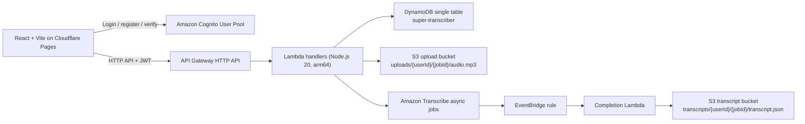

# Super Transcriber

Super Transcriber is a low-traffic transcription app built for near-zero fixed cost. Users upload MP3 files directly to S3, Lambda starts Amazon Transcribe async jobs, EventBridge finalizes completed jobs, and a React app on Cloudflare Pages handles auth, upload, polling, and transcript export.

## Architecture



## Cost Profile

| Service | Pricing model | Notes |
|---|---|---|
| Cloudflare Pages | Free tier | SPA hosting |
| Cognito User Pools | Permanent free tier | No hosted UI used |
| Lambda | Per request and GB-second | All functions run on `arm64` |
| API Gateway HTTP API | Per request | Cheaper than REST API |
| DynamoDB | `PAY_PER_REQUEST` | No provisioned capacity |
| S3 | Storage + requests | Lifecycle rules minimize retained data |
| EventBridge | Per event | Negligible at this scale |
| Amazon Transcribe | $0.024/min after free tier | Main variable cost driver |

## Repository Layout

```text
terraform/  Terraform infrastructure, backend config examples, outputs
cdk/        Lambda TypeScript sources and bundling toolchain
frontend/   React 18 + Vite single-page app
.github/    GitHub Actions workflows
```

## Prerequisites

- AWS account with access to Cognito, Lambda, API Gateway HTTP API, S3, DynamoDB, and EventBridge
- Terraform 1.14+
- Node.js 20+
- npm 10+
- Cloudflare Pages project
- GitHub Actions OIDC role for AWS deploys

## First-Time Setup

1. Install dependencies:

```bash
cd /Users/aiden/Documents/Codex/2026-04-27/github-plugin-github-openai-curated-codex/cdk && npm ci
cd /Users/aiden/Documents/Codex/2026-04-27/github-plugin-github-openai-curated-codex/frontend && npm ci
```

2. Copy [terraform/terraform.tfvars.example](/Users/aiden/Documents/Codex/2026-04-27/github-plugin-github-openai-curated-codex/terraform/terraform.tfvars.example) to `terraform.tfvars` and set `allowed_origin` to your Cloudflare Pages URL.

3. Bundle Lambda artifacts:

```bash
cd /Users/aiden/Documents/Codex/2026-04-27/github-plugin-github-openai-curated-codex/cdk
npm run build:lambdas
```

## Terraform State Backend

For local-only testing you can use `terraform init -backend=false`. For repeatable deploys and GitHub Actions, use an S3 backend plus a DynamoDB lock table.

One-time backend bootstrap example:

```bash
aws s3api create-bucket --bucket your-terraform-state-bucket --region us-east-1
aws s3api put-bucket-versioning --bucket your-terraform-state-bucket --versioning-configuration Status=Enabled
aws dynamodb create-table \
  --table-name your-terraform-lock-table \
  --attribute-definitions AttributeName=LockID,AttributeType=S \
  --key-schema AttributeName=LockID,KeyType=HASH \
  --billing-mode PAY_PER_REQUEST \
  --region us-east-1
```

Then copy [terraform/backend.hcl.example](/Users/aiden/Documents/Codex/2026-04-27/github-plugin-github-openai-curated-codex/terraform/backend.hcl.example) to `backend.hcl` and fill in your state bucket, key, and lock table.

## Deploy AWS with Terraform

```bash
cd /Users/aiden/Documents/Codex/2026-04-27/github-plugin-github-openai-curated-codex/terraform
terraform init -backend-config=backend.hcl
terraform plan
terraform apply
```

Useful outputs:

```bash
terraform output -raw api_base_url
terraform output -raw cognito_user_pool_id
terraform output -raw cognito_client_id
terraform output -raw aws_region
```

## Frontend Setup

Copy [frontend/.env.example](/Users/aiden/Documents/Codex/2026-04-27/github-plugin-github-openai-curated-codex/frontend/.env.example) to `.env` and fill it from Terraform outputs:

```env
VITE_API_BASE_URL=...
VITE_COGNITO_USER_POOL_ID=...
VITE_COGNITO_CLIENT_ID=...
VITE_AWS_REGION=us-east-1
```

Local frontend development:

```bash
cd /Users/aiden/Documents/Codex/2026-04-27/github-plugin-github-openai-curated-codex/frontend
npm run dev
```

## GitHub Actions

### AWS deploy workflow

File: [.github/workflows/deploy-aws.yml](/Users/aiden/Documents/Codex/2026-04-27/github-plugin-github-openai-curated-codex/.github/workflows/deploy-aws.yml)

Required secret:

- `AWS_GITHUB_ACTIONS_ROLE_ARN`

Required repository variables:

- `TF_AWS_REGION`
- `TF_ALLOWED_ORIGIN`
- `TF_STATE_BUCKET`
- `TF_STATE_KEY`
- `TF_STATE_REGION`
- `TF_STATE_LOCK_TABLE`

Optional repository variables:

- `TF_ENVIRONMENT`
- `TF_PROJECT_NAME`

### Frontend deploy workflow

File: [.github/workflows/deploy-frontend.yml](/Users/aiden/Documents/Codex/2026-04-27/github-plugin-github-openai-curated-codex/.github/workflows/deploy-frontend.yml)

Required secrets:

- `CLOUDFLARE_API_TOKEN`
- `CLOUDFLARE_ACCOUNT_ID`

Required repository variables:

- `VITE_API_BASE_URL`
- `VITE_COGNITO_USER_POOL_ID`
- `VITE_COGNITO_CLIENT_ID`
- `VITE_AWS_REGION`

## Security Notes

- No Lambda runs in a VPC.
- S3 buckets block all public access.
- Client uploads use presigned URLs only.
- API Gateway only allows the configured Pages origin.
- Tokens stay in Zustand memory only.
- JWT validation is handled by the HTTP API Cognito authorizer.

## Operational Notes

- Upload objects expire after 3 days.
- Transcript JSON expires after 90 days.
- Active jobs are capped at 5 per user.
- Polling starts at 3 seconds, backs off to 30 seconds, and stops after 15 minutes.
