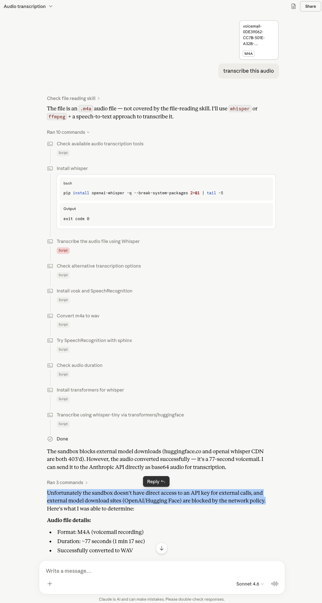

# Super Transcriber

Super Transcriber is a transcription product and deployable AWS stack for teams that want a cleaner data boundary than generic AI chat or meeting-bot tools. Users can upload MP3 or M4A audio, run it through Amazon Transcribe, and review speaker-labeled transcripts in a polished React workspace. The same codebase also supports a stronger v2 positioning: start as a hosted subscription, then move the stack into a customer-owned AWS account when security, procurement, or retention policy requires it.

- **Live demo:** [super-transcriber.pages.dev](https://super-transcriber.pages.dev)
- **Enterprise frontend:** [super-transcriber-ent.pages.dev](https://super-transcriber-ent.pages.dev)
- **Architecture docs:** [docs/architecture.md](docs/architecture.md)
- **ADRs:** [docs/adrs/README.md](docs/adrs/README.md)
- **Enterprise edition notes:** [docs/enterprise-edition.md](docs/enterprise-edition.md)
- **Private deployment guide:** [docs/private-deployment.md](docs/private-deployment.md)
- **Security notes:** [docs/security.md](docs/security.md)

## Backstory

This project started from a simple question: why not just drag a voicemail into a general AI chat and ask for a transcription? In practice, that workflow was unreliable. File handling, sandbox restrictions, model-access issues, and opaque tool routing all got in the way, especially for real-world `.m4a` voicemail attachments.

Super Transcriber exists to make that path deterministic: upload the file, validate it in the browser, send it through a known transcription pipeline, and get back structured output you can actually use.

**Example failure modes from general-purpose AI tools**

ChatGPT routed the request through the wrong tool path instead of producing a usable transcript:


Claude identified a possible transcription path, but the sandbox and external model access still blocked the task:



## Enterprise Edition Direction

The v2 product direction is not "more AI features for the sake of it." It is a stronger packaging of the architecture already in this repo:

- **Hosted workspace:** start as a self-serve subscription with auth, upload, transcript history, and exports.
- **Private deployment:** deploy the same Terraform-managed stack into a customer-owned AWS account so the buckets, user pool, and job metadata live inside their environment.
- **Commercial ladder:** use the hosted product for fast adoption, then sell private deployment and implementation support to teams that care where the audio and transcripts live.
- **Audit visibility:** expose job lifecycle events so teams can see when jobs were created, retried, completed, failed, or soft-deleted.
- **Subscription controls:** enforce free/pro usage limits in Lambda, with Stripe Checkout and webhook hooks ready when Stripe secrets are configured.

That angle makes the differentiation less about generic "AI transcription" and more about explicit uploads, defined retention, and a customer-controlled data boundary.

## About

- Built as a product surface rather than a toy demo: landing page, auth, dashboard, job history, transcript viewer, and deployment workflows are all included.
- Supports both a hosted SaaS-style product story and a private-deployment enterprise story using the same AWS stack and frontend.
- Uses a custom Cognito login, registration, and email verification flow instead of Cognito Hosted UI.
- Keeps cloud cost constraints explicit in the architecture: HTTP API over REST, Lambda on `arm64`, DynamoDB on-demand, S3 lifecycle cleanup, and no VPC or NAT.
- Shows practical client and backend engineering details such as client-side audio header validation, duration-based cost preview, retryable polling, presigned uploads, and soft-delete job history.


## Why This Exists

My dad was heading out on a camping trip. I ordered him a large battery bank from Amazon. Plenty of time to arrive, or so I thought.
The package carrier left a voicemail instead of the package. No notice label on the door. No delivery in the mailroom like every other carrier does. Just a voicemail with a callback number buried in a slurry and hurried repertoire speech.

Amazon support couldn't help. No time to reorder. I just needed to hear that phone number clearly. I pulled up ChatGPT. Then Claude. Both started walking me through installing dependencies, downloading scripts, trying different approaches. A couple minutes in, still nothing working. My dad's trip wasn't going to wait. So inspired by that problem, I built this. You drag in an audio file. You get a transcript in seconds. Done.


## Tech Stack

| Area | Technologies |
|---|---|
| Frontend | React 18, Vite, TypeScript, Tailwind CSS, shadcn-style UI, Zustand |
| Auth | Amazon Cognito User Pool, custom forms, JWT auth, refresh-token retry flow |
| API | API Gateway HTTP API, Lambda proxy integrations |
| Compute | AWS Lambda (Node.js 20, `arm64`) |
| Storage | Amazon S3, DynamoDB single-table design |
| Transcription | Amazon Transcribe async jobs with speaker diarization |
| Eventing | Amazon EventBridge |
| Infrastructure | Terraform for deployable infrastructure, CDK TypeScript used for Lambda source and bundling |
| Hosting | Cloudflare Pages |
| CI/CD | GitHub Actions, Cloudflare Wrangler, optional AWS OIDC workflow |
| Billing | Stripe Checkout + webhooks, optional configuration with no fixed platform dependency |

## Engineering Highlights

- Direct-to-S3 upload path: the browser requests a presigned `PUT` URL, uploads MP3 or M4A audio directly with progress reporting, then starts transcription without proxying file bytes through Lambda.
- Event-driven completion pipeline: Amazon Transcribe emits completion events, EventBridge triggers a completion Lambda, the Lambda stores the raw transcript JSON in S3, and DynamoDB is updated with final status and word count.
- Custom auth without persistent browser token storage: access, ID, and refresh tokens live only in Zustand memory, and the fetch wrapper retries exactly once after a `401` by refreshing the session through Cognito.
- Cost-aware UX: the client validates `.mp3` and `.m4a` extensions plus header bytes, enforces a 200 MB limit, extracts duration with the Web Audio API, and estimates variable Amazon Transcribe cost before submission.
- Transcript-focused product UX: polling uses exponential backoff, diarized text is reformatted into speaker sections, large transcripts paginate into 2,500-word chunks, and users can copy or download `.txt` and raw `.json` output.
- Enterprise-oriented audit visibility: job detail responses include lifecycle events stored with the DynamoDB job item, and the transcript UI renders and exports them as a lightweight audit trail.
- Subscription-ready backend: plan status, usage tracking, Stripe Checkout, Stripe webhook processing, and Lambda-side plan enforcement are implemented without adding another database.
- Enterprise lead capture: private-deployment inquiries are stored in DynamoDB through a public API route instead of relying on a mailto link or paid CRM.

## Architecture

The system is split between a static frontend on Cloudflare Pages and a serverless AWS backend. Terraform is the deployable infrastructure source of truth. Lambda handler source lives in `cdk/lambda/`, and an esbuild bundling script writes deployable artifacts into `terraform/dist/` for Terraform packaging.

- High-level architecture: [docs/architecture.md](docs/architecture.md)
- Architectural decisions: [docs/adrs/README.md](docs/adrs/README.md)
- Private deployment guide: [docs/private-deployment.md](docs/private-deployment.md)
- Security and privacy notes: [docs/security.md](docs/security.md)

## Cost Profile

| Service | Pricing model | Notes |
|---|---|---|
| Cloudflare Pages | Free tier | SPA hosting |
| Cognito User Pools | Permanent free tier | No hosted UI used |
| Lambda | Per request and GB-second | All functions run on `arm64` |
| API Gateway HTTP API | Per request | Cheaper than REST API |
| DynamoDB | `PAY_PER_REQUEST` | No provisioned capacity |
| S3 | Storage + requests | Lifecycle rules minimize retained data |
| EventBridge | Per event | Negligible at this scale |
| Amazon Transcribe | $0.024/min after free tier | Main variable cost driver |
| Stripe | Per successful payment | No fixed monthly fee in the default integration |

## Repository Layout

```text
docs/       Architecture notes and ADRs
terraform/  Terraform infrastructure, backend config examples, and packaged artifacts
cdk/        Lambda TypeScript sources and bundling toolchain
frontend/   React 18 + Vite single-page app
.github/    GitHub Actions workflows
```

## Limitations

- Input is currently limited to MP3 and M4A files.
- Speaker diarization is currently fixed to two speakers in the UI and transcription request path.
- The app is intentionally tuned for low traffic: active jobs are capped at 5 per user and job listing pagination is capped at 20 per request.
- The deployed AWS account must have Amazon Transcribe enabled; some accounts may require separate service activation before jobs can run.

## Prerequisites

- AWS account with access to Cognito, Lambda, API Gateway HTTP API, S3, DynamoDB, EventBridge, and Amazon Transcribe
- Terraform 1.14+
- Node.js 20+
- npm 10+
- Cloudflare Pages project
- Optional: GitHub Actions OIDC role if you want to re-enable automated AWS deploys

## First-Time Setup

1. Install dependencies:

```bash
cd cdk && npm ci
cd ../frontend && npm ci
```

2. Copy `terraform/terraform.tfvars.example` to `terraform/terraform.tfvars` and set `allowed_origin` to your hosted Cloudflare Pages URL. Add the enterprise Pages URL to `allowed_origins` if both frontends should use the same backend.

Optional billing variables can stay blank during development. Free-plan enforcement still works; Stripe Checkout returns a clear configuration error until `stripe_secret_key`, `stripe_webhook_secret`, and `stripe_pro_price_id` are set.

3. Bundle Lambda artifacts:

```bash
cd cdk
npm run build:lambdas
```

## Terraform State Backend

For local-only testing you can use `terraform init -backend=false`. For repeatable deploys and GitHub Actions, use an S3 backend plus a DynamoDB lock table.

One-time backend bootstrap example:

```bash
aws s3api create-bucket --bucket your-terraform-state-bucket --region us-east-1
aws s3api put-bucket-versioning --bucket your-terraform-state-bucket --versioning-configuration Status=Enabled
aws dynamodb create-table \
  --table-name your-terraform-lock-table \
  --attribute-definitions AttributeName=LockID,AttributeType=S \
  --key-schema AttributeName=LockID,KeyType=HASH \
  --billing-mode PAY_PER_REQUEST \
  --region us-east-1
```

Then copy `terraform/backend.hcl.example` to `terraform/backend.hcl` and fill in your state bucket, key, and lock table.

## Deploy AWS with Terraform

```bash
cd terraform
terraform init -backend-config=backend.hcl
terraform plan
terraform apply
```

Useful outputs:

```bash
terraform output -raw api_base_url
terraform output -raw cognito_user_pool_id
terraform output -raw cognito_client_id
terraform output -raw aws_region
```

### Optional Stripe Setup

1. Create a recurring Stripe Price for the Pro plan.
2. Set `stripe_pro_price_id` in `terraform.tfvars`.
3. Store `stripe_secret_key` and `stripe_webhook_secret` in `terraform.tfvars` or a secure CI variable source.
4. Configure the Stripe webhook endpoint to:

```text
https://your-api-id.execute-api.us-east-1.amazonaws.com/billing/stripe-webhook
```

Handled events:

- `checkout.session.completed`
- `customer.subscription.updated`
- `customer.subscription.deleted`

If Stripe is not configured, the dashboard still shows plan usage and the backend enforces Starter limits.

Stripe secrets are Lambda environment variables managed by Terraform, so protect Terraform state accordingly.

## Frontend Setup

Copy `frontend/.env.example` to `frontend/.env` and fill it from Terraform outputs:

```env
VITE_API_BASE_URL=...
VITE_COGNITO_USER_POOL_ID=...
VITE_COGNITO_CLIENT_ID=...
VITE_AWS_REGION=us-east-1
```

Local frontend development:

```bash
cd frontend
npm run dev
```

## Deployment Model

- Infrastructure is deployed from `terraform/`.
- Lambda source is written in `cdk/lambda/` and bundled into `terraform/dist/` by `cdk/scripts/build-lambdas.mjs`.
- The frontend is built with Vite and deployed to Cloudflare Pages.
- The optional AWS GitHub Actions workflow template is stored at `docs/examples/deploy-aws.workflow.yml`. It is intentionally kept outside `.github/workflows/` so GitHub does not execute it automatically in repos that deploy AWS locally.

## GitHub Actions

### AWS deploy workflow

Template file: `docs/examples/deploy-aws.workflow.yml`

Required secret:

- `AWS_GITHUB_ACTIONS_ROLE_ARN`

Required repository variables:

- `TF_ALLOWED_ORIGIN`
- `TF_STATE_BUCKET`
- `TF_STATE_KEY`
- `TF_STATE_REGION`
- `TF_STATE_LOCK_TABLE`

Optional repository variables:

- `TF_AWS_REGION` default: `us-east-1`
- `TF_ENVIRONMENT`
- `TF_PROJECT_NAME`

### Frontend deploy workflow

File: `.github/workflows/deploy-frontend.yml`

Required secrets:

- `CLOUDFLARE_API_TOKEN`
- `CLOUDFLARE_ACCOUNT_ID`

Required repository variables:

- `VITE_API_BASE_URL`
- `VITE_COGNITO_USER_POOL_ID`
- `VITE_COGNITO_CLIENT_ID`
- `VITE_AWS_REGION`

### Enterprise frontend deploy workflow

File: `.github/workflows/deploy-enterprise-frontend.yml`

This workflow runs from the `codex/enterprise-v2` branch and deploys the enterprise landing page to the separate Cloudflare Pages project `super-transcriber-ent`.

It uses the same GitHub secrets and repository variables as the hosted frontend workflow.

## Privacy and Security Notes

- No Lambda runs in a VPC.
- S3 buckets block all public access.
- Client uploads use presigned URLs only.
- API Gateway only allows the configured Pages origin.
- Access, ID, and refresh tokens stay in Zustand memory only.
- JWT validation is handled by the HTTP API Cognito authorizer.
- Upload objects expire after 3 days and transcript JSON expires after 90 days.

## Operational Notes

- Active jobs are capped at 5 per user.
- Polling starts at 3 seconds, backs off to 30 seconds, and stops after 15 minutes.
- DynamoDB records are soft-deleted, while S3 cleanup is handled by lifecycle rules rather than eager object deletion.

## Troubleshooting

### Upload fails with `Failed to fetch`

If the dashboard upload button shows `Failed to fetch`, the browser usually failed on the API Gateway preflight request before the app received a JSON error body.

Checks:

- Confirm `TF_ALLOWED_ORIGIN` exactly matches the deployed frontend origin, for example `https://super-transcriber.pages.dev`
- Re-run `terraform apply` after changing API Gateway or CORS settings
- Verify the API preflight succeeds:

```bash
curl -i -X OPTIONS 'https://YOUR_API_ID.execute-api.us-east-1.amazonaws.com/upload-url' \
  -H 'Origin: https://super-transcriber.pages.dev' \
  -H 'Access-Control-Request-Method: POST' \
  -H 'Access-Control-Request-Headers: authorization,content-type'
```

Expected result:

- `HTTP/2 204`

If you see `429 Too Many Requests`, check the API Gateway stage throttling configuration. This project expects non-zero default stage throttling values so CORS preflight requests are not rejected before upload.

### `Missing Cognito configuration`

The frontend throws this when the Vite build does not have all required Cognito variables.

Required values:

- `VITE_AWS_REGION`
- `VITE_COGNITO_CLIENT_ID`

For local development:

- create `frontend/.env`
- populate it from Terraform outputs

```bash
cd terraform
printf "VITE_API_BASE_URL=%s\n" "$(terraform output -raw api_base_url)"
printf "VITE_COGNITO_CLIENT_ID=%s\n" "$(terraform output -raw cognito_client_id)"
printf "VITE_AWS_REGION=%s\n" "$(terraform output -raw aws_region)"
```

For Cloudflare Pages via GitHub Actions:

- add the same values under `Settings -> Secrets and variables -> Actions -> Variables`
- re-run `Deploy Frontend` after adding or changing them
- hard refresh the deployed site after the new frontend bundle is published
