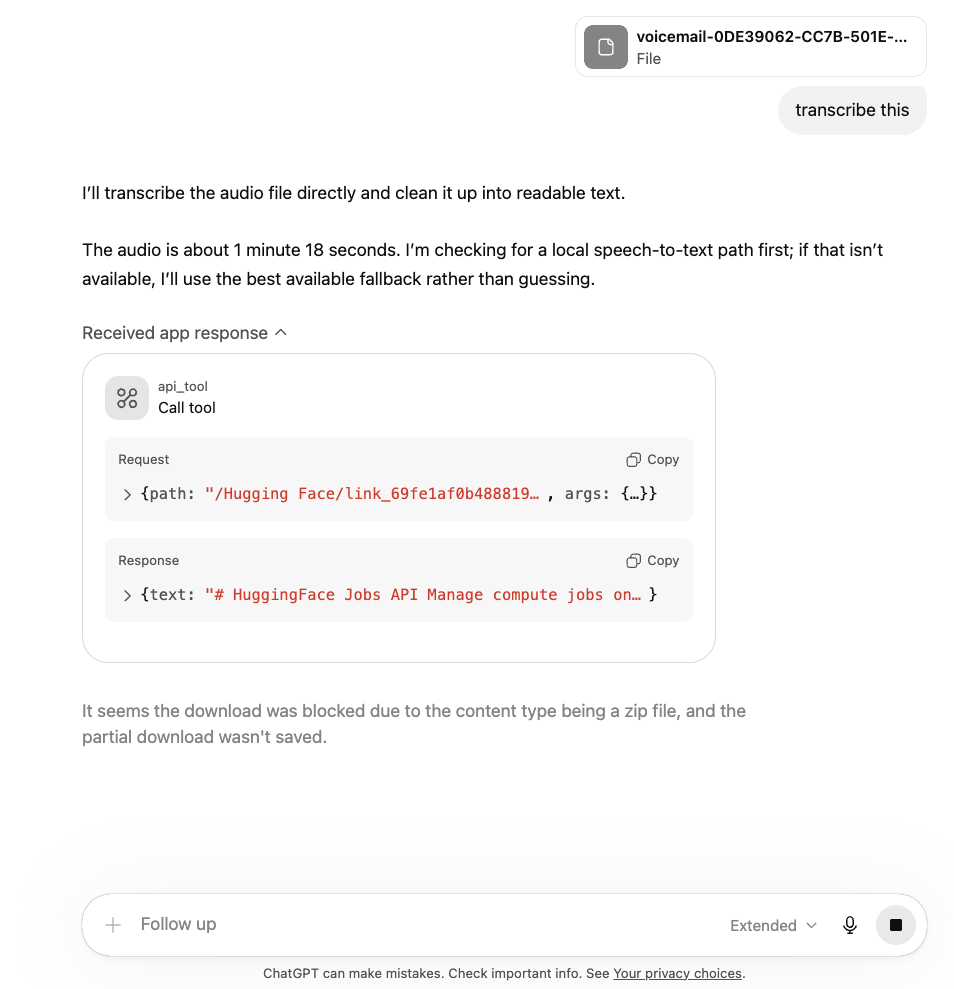

# Super Transcriber

Super Transcriber is a cost-aware transcription web app and deployable AWS serverless stack. Authenticated users upload MP3 or M4A audio, the browser sends the file directly to private S3, Amazon Transcribe processes it asynchronously, and the app returns a speaker-labeled transcript with copy/download actions.

- **Live demo:** [super-transcriber.pages.dev](https://super-transcriber.pages.dev)
- **Enterprise frontend:** [super-transcriber-ent.pages.dev](https://super-transcriber-ent.pages.dev)
- **Architecture docs:** [docs/architecture.md](docs/architecture.md)
- **Validation evidence:** [docs/validation-evidence.md](docs/validation-evidence.md)
- **ADRs:** [docs/adrs/README.md](docs/adrs/README.md)
- **Enterprise edition notes:** [docs/enterprise-edition.md](docs/enterprise-edition.md)
- **Private deployment guide:** [docs/private-deployment.md](docs/private-deployment.md)
- **Security notes:** [docs/security.md](docs/security.md)

## About

- **What it proves:** AWS serverless architecture, Terraform IaC, secure auth, direct-to-S3 upload design, async event processing, cost controls, and deployment documentation.
- **What it is not claiming:** production traffic, enterprise customers, or fully automated AWS deployment from GitHub Actions.
- **Deployment model:** frontend deployment is manual through GitHub Actions/Cloudflare credentials; AWS deployment is Terraform-managed and intentionally manual unless GitHub OIDC is configured.
- **Product direction:** a hosted subscription app with a private-deployment path for customers that want audio, transcripts, identity, and metadata inside their own AWS account.

## AWS Architecture

The backend uses AWS managed services without a VPC or fixed-cost infrastructure:

1. Cognito authenticates users through custom React forms.
2. API Gateway HTTP API validates JWTs with a Cognito authorizer.
3. Lambda returns a presigned S3 `PUT` URL after validating user/job limits.
4. The browser uploads audio directly to a private S3 uploads bucket.
5. Lambda starts an async Amazon Transcribe job and records status in DynamoDB.
6. EventBridge receives the Transcribe state-change event and triggers the completion Lambda.
7. The completion Lambda stores raw transcript JSON in S3 and updates the DynamoDB job item.
8. The transcript page polls the API and renders speaker-labeled text with copy and export actions.

See [docs/architecture.md](docs/architecture.md) for the C4-style Mermaid diagram and runtime flow.

## Cloud Architecture Evidence

The repo includes implementation and documentation evidence for the cloud pipeline:

- Cognito custom auth, registration, email verification, and token refresh flow.
- Presigned private S3 upload flow with browser-side progress reporting.
- Amazon Transcribe async job creation with speaker diarization.
- EventBridge completion rule and Lambda completion handler.
- DynamoDB single-table job, billing, usage, and audit-event records.
- Private transcript JSON storage in S3.
- Cloudflare Pages deployment workflow for the static React app.
- Terraform-managed API Gateway, Lambda, S3, DynamoDB, Cognito, and EventBridge resources.

The capture checklist for screenshots/logs is in [docs/validation-evidence.md](docs/validation-evidence.md).


## Tech Stack

| Area | Technologies |
|---|---|
| Frontend | React 18, Vite, TypeScript, Tailwind CSS, shadcn-style UI, Zustand |
| Auth | Amazon Cognito User Pool, custom forms, JWT auth, refresh-token retry flow |
| API | API Gateway HTTP API, Lambda proxy integrations |
| Compute | AWS Lambda (Node.js 20, `arm64`) |
| Storage | Amazon S3, DynamoDB single-table design |
| Transcription | Amazon Transcribe async jobs with speaker diarization |
| Eventing | Amazon EventBridge |
| Infrastructure | Terraform for deployable infrastructure, CDK TypeScript used for Lambda source and bundling |
| Hosting | Cloudflare Pages |
| CI/CD | GitHub Actions CI, manual Cloudflare deploy workflows, optional AWS OIDC workflow template |
| Billing | Stripe Checkout + webhooks, optional configuration with no fixed platform dependency |

## Engineering Highlights

- Direct-to-S3 upload path: the browser requests a presigned `PUT` URL, uploads MP3 or M4A audio directly with progress reporting, then starts transcription without proxying file bytes through Lambda.
- Event-driven completion pipeline: Amazon Transcribe emits completion events, EventBridge triggers a completion Lambda, the Lambda stores the raw transcript JSON in S3, and DynamoDB is updated with final status and word count.
- Custom auth without persistent browser token storage: access, ID, and refresh tokens live only in Zustand memory, and the fetch wrapper retries exactly once after a `401` by refreshing the session through Cognito.
- Cost-aware UX: the client validates `.mp3` and `.m4a` extensions plus header bytes, enforces a 200 MB limit, extracts duration with the Web Audio API, and estimates variable Amazon Transcribe cost before submission.
- Transcript-focused product UX: polling uses exponential backoff, diarized text is reformatted into speaker sections, large transcripts paginate into 2,500-word chunks, and users can copy or download `.txt` and raw `.json` output.
- Enterprise-oriented audit visibility: job detail responses include lifecycle events stored with the DynamoDB job item, and the transcript UI renders and exports them as a lightweight audit trail.
- Subscription-ready backend: plan status, usage tracking, Stripe Checkout, Stripe webhook processing, and Lambda-side plan enforcement are implemented without adding another database.
- Enterprise lead capture: private-deployment inquiries are stored in DynamoDB through a public API route instead of relying on a mailto link or paid CRM.

## CI and Deployment Status

- `.github/workflows/ci.yml` runs on push and pull request. It builds the frontend, builds and bundles Lambda TypeScript, checks Terraform formatting, initializes Terraform without the remote backend, validates Terraform, and sanity-checks workflow YAML.
- `.github/workflows/deploy-frontend.yml` is manual-only and deploys the hosted frontend to Cloudflare Pages when `CLOUDFLARE_API_TOKEN`, `CLOUDFLARE_ACCOUNT_ID`, and Vite build variables are configured.
- `.github/workflows/deploy-enterprise-frontend.yml` is manual-only and deploys the enterprise positioning frontend to the separate `super-transcriber-ent` Cloudflare Pages project.
- `docs/examples/deploy-aws.workflow.yml` is an optional Terraform AWS deploy workflow template. It is intentionally not active by default because it requires a GitHub OIDC role and Terraform state backend variables.

## Cost and Security Controls

- HTTP API is used instead of REST API for lower request cost.
- Lambda functions use Node.js 20 on `arm64`.
- DynamoDB uses on-demand billing.
- S3 lifecycle rules expire uploads and transcript artifacts.
- No Lambda runs in a VPC, avoiding NAT Gateway cost.
- S3 buckets are private and accessed by presigned URLs or Lambda IAM permissions.
- Cognito tokens are kept in memory only by the frontend.
- API Gateway CORS and S3 CORS are scoped to configured Cloudflare Pages origins.

## Enterprise Edition Direction

The v2 product direction is a stronger packaging of the architecture already in this repo:

- **Hosted workspace:** start as a self-serve subscription with auth, upload, transcript history, and exports.
- **Private deployment:** deploy the same Terraform-managed stack into a customer-owned AWS account so buckets, user pool, and job metadata live inside their environment.
- **Commercial ladder:** use the hosted product for fast adoption, then sell private deployment and implementation support to teams that care where audio and transcripts live.
- **Audit visibility:** expose job lifecycle events so teams can see when jobs were created, retried, completed, failed, or soft-deleted.
- **Subscription controls:** enforce free/pro usage limits in Lambda, with Stripe Checkout and webhook hooks ready when Stripe secrets are configured.

## Origin Story

This started from a practical failure: a voicemail had the callback number needed to solve a delivery problem, but generic AI chat tools could not reliably transcribe the `.m4a` attachment in time. Super Transcriber turns that path into a deterministic workflow: upload the audio, validate it, run it through a known AWS transcription pipeline, and get structured output back.

ChatGPT understood the request, but routed the file through a tool path that could not access the audio content:



Claude identified the file as M4A and tried several local transcription paths, but sandbox and external model-download restrictions still blocked the final transcript:


## Architecture

The system is split between a static frontend on Cloudflare Pages and a serverless AWS backend. Terraform is the deployable infrastructure source of truth. Lambda handler source lives in `cdk/lambda/`, and an esbuild bundling script writes deployable artifacts into `terraform/dist/` for Terraform packaging.

- High-level architecture: [docs/architecture.md](docs/architecture.md)
- Validation evidence checklist: [docs/validation-evidence.md](docs/validation-evidence.md)
- Architectural decisions: [docs/adrs/README.md](docs/adrs/README.md)
- Private deployment guide: [docs/private-deployment.md](docs/private-deployment.md)
- Security and privacy notes: [docs/security.md](docs/security.md)

## Cost Profile

| Service | Pricing model | Notes |
|---|---|---|
| Cloudflare Pages | Free tier | SPA hosting |
| Cognito User Pools | Permanent free tier | No hosted UI used |
| Lambda | Per request and GB-second | All functions run on `arm64` |
| API Gateway HTTP API | Per request | Cheaper than REST API |
| DynamoDB | `PAY_PER_REQUEST` | No provisioned capacity |
| S3 | Storage + requests | Lifecycle rules minimize retained data |
| EventBridge | Per event | Negligible at this scale |
| Amazon Transcribe | $0.024/min after free tier | Main variable cost driver |
| Stripe | Per successful payment | No fixed monthly fee in the default integration |

## Repository Layout

```text
docs/       Architecture notes and ADRs
terraform/  Terraform infrastructure, backend config examples, and packaged artifacts
cdk/        Lambda TypeScript sources and bundling toolchain
frontend/   React 18 + Vite single-page app
.github/    GitHub Actions workflows
```

## Limitations

- Input is currently limited to MP3 and M4A files.
- Speaker diarization is currently fixed to two speakers in the UI and transcription request path.
- The app is intentionally tuned for low traffic: active jobs are capped at 5 per user and job listing pagination is capped at 20 per request.
- The deployed AWS account must have Amazon Transcribe enabled; some accounts may require separate service activation before jobs can run.

## Prerequisites

- AWS account with access to Cognito, Lambda, API Gateway HTTP API, S3, DynamoDB, EventBridge, and Amazon Transcribe
- Terraform 1.14+
- Node.js 20+
- npm 10+
- Cloudflare Pages project
- Optional: GitHub Actions OIDC role if you want to re-enable automated AWS deploys

## First-Time Setup

1. Install dependencies:

```bash
cd cdk && npm ci
cd ../frontend && npm ci
```

2. Copy `terraform/terraform.tfvars.example` to `terraform/terraform.tfvars` and set `allowed_origin` to your hosted Cloudflare Pages URL. Add the enterprise Pages URL to `allowed_origins` if both frontends should use the same backend.

Optional billing variables can stay blank during development. Free-plan enforcement still works; Stripe Checkout returns a clear configuration error until `stripe_secret_key`, `stripe_webhook_secret`, and `stripe_pro_price_id` are set.

3. Bundle Lambda artifacts:

```bash
cd cdk
npm run build:lambdas
```

## Terraform State Backend

For local-only testing you can use `terraform init -backend=false`. For repeatable deploys and GitHub Actions, use an S3 backend plus a DynamoDB lock table.

One-time backend bootstrap example:

```bash
aws s3api create-bucket --bucket your-terraform-state-bucket --region us-east-1
aws s3api put-bucket-versioning --bucket your-terraform-state-bucket --versioning-configuration Status=Enabled
aws dynamodb create-table \
  --table-name your-terraform-lock-table \
  --attribute-definitions AttributeName=LockID,AttributeType=S \
  --key-schema AttributeName=LockID,KeyType=HASH \
  --billing-mode PAY_PER_REQUEST \
  --region us-east-1
```

Then copy `terraform/backend.hcl.example` to `terraform/backend.hcl` and fill in your state bucket, key, and lock table.

## Deploy AWS with Terraform

```bash
cd terraform
terraform init -backend-config=backend.hcl
terraform plan
terraform apply
```

Useful outputs:

```bash
terraform output -raw api_base_url
terraform output -raw cognito_user_pool_id
terraform output -raw cognito_client_id
terraform output -raw aws_region
```

### Optional Stripe Setup

1. Create a recurring Stripe Price for the Pro plan.
2. Set `stripe_pro_price_id` in `terraform.tfvars`.
3. Store `stripe_secret_key` and `stripe_webhook_secret` in `terraform.tfvars` or a secure CI variable source.
4. Configure the Stripe webhook endpoint to:

```text
https://your-api-id.execute-api.us-east-1.amazonaws.com/billing/stripe-webhook
```

Handled events:

- `checkout.session.completed`
- `customer.subscription.updated`
- `customer.subscription.deleted`

If Stripe is not configured, the dashboard still shows plan usage and the backend enforces Starter limits.

Stripe secrets are Lambda environment variables managed by Terraform, so protect Terraform state accordingly.

## Frontend Setup

Copy `frontend/.env.example` to `frontend/.env` and fill it from Terraform outputs:

```env
VITE_API_BASE_URL=...
VITE_COGNITO_CLIENT_ID=...
VITE_AWS_REGION=us-east-1
```

Local frontend development:

```bash
cd frontend
npm run dev
```

## Deployment Model

- Infrastructure is deployed from `terraform/`; AWS deployment is manual unless you configure the optional GitHub OIDC workflow template.
- Lambda source is written in `cdk/lambda/` and bundled into `terraform/dist/` by `cdk/scripts/build-lambdas.mjs`.
- The frontend is built with Vite and deployed to Cloudflare Pages through manual GitHub Actions workflows.
- The optional AWS GitHub Actions workflow template is stored at `docs/examples/deploy-aws.workflow.yml`. It is intentionally kept outside `.github/workflows/` so GitHub does not execute AWS changes automatically in repos that deploy AWS locally.

## GitHub Actions

### AWS deploy workflow

Template file: `docs/examples/deploy-aws.workflow.yml`

Required secret:

- `AWS_GITHUB_ACTIONS_ROLE_ARN`

Required repository variables:

- `TF_ALLOWED_ORIGIN`
- `TF_STATE_BUCKET`
- `TF_STATE_KEY`
- `TF_STATE_REGION`
- `TF_STATE_LOCK_TABLE`

Optional repository variables:

- `TF_AWS_REGION` default: `us-east-1`
- `TF_ENVIRONMENT`
- `TF_PROJECT_NAME`

### Frontend deploy workflow

File: `.github/workflows/deploy-frontend.yml`

Required secrets:

- `CLOUDFLARE_API_TOKEN`
- `CLOUDFLARE_ACCOUNT_ID`

Required repository variables:

- `VITE_API_BASE_URL`
- `VITE_COGNITO_CLIENT_ID`
- `VITE_AWS_REGION`

### Enterprise frontend deploy workflow

File: `.github/workflows/deploy-enterprise-frontend.yml`

This manual workflow deploys the enterprise landing page to the separate Cloudflare Pages project `super-transcriber-ent`.

It uses the same GitHub secrets and repository variables as the hosted frontend workflow.

## Privacy and Security Notes

- No Lambda runs in a VPC.
- S3 buckets block all public access.
- Client uploads use presigned URLs only.
- API Gateway only allows the configured Pages origin.
- Access, ID, and refresh tokens stay in Zustand memory only.
- JWT validation is handled by the HTTP API Cognito authorizer.
- Upload objects expire after 3 days and transcript JSON expires after 90 days.

## Operational Notes

- Active jobs are capped at 5 per user.
- Polling starts at 3 seconds, backs off to 30 seconds, and stops after 15 minutes.
- DynamoDB records are soft-deleted, while S3 cleanup is handled by lifecycle rules rather than eager object deletion.

## Troubleshooting

### Upload fails with `Failed to fetch`

If the dashboard upload button shows `Failed to fetch`, the browser usually failed on the API Gateway preflight request before the app received a JSON error body.

Checks:

- Confirm `TF_ALLOWED_ORIGIN` exactly matches the deployed frontend origin, for example `https://super-transcriber.pages.dev`
- Re-run `terraform apply` after changing API Gateway or CORS settings
- Verify the API preflight succeeds:

```bash
curl -i -X OPTIONS 'https://YOUR_API_ID.execute-api.us-east-1.amazonaws.com/upload-url' \
  -H 'Origin: https://super-transcriber.pages.dev' \
  -H 'Access-Control-Request-Method: POST' \
  -H 'Access-Control-Request-Headers: authorization,content-type'
```

Expected result:

- `HTTP/2 204`

If you see `429 Too Many Requests`, check the API Gateway stage throttling configuration. This project expects non-zero default stage throttling values so CORS preflight requests are not rejected before upload.

### `Missing Cognito configuration`

The frontend throws this when the Vite build does not have all required Cognito variables.

Required values:

- `VITE_AWS_REGION`
- `VITE_COGNITO_CLIENT_ID`

For local development:

- create `frontend/.env`
- populate it from Terraform outputs

```bash
cd terraform
printf "VITE_API_BASE_URL=%s\n" "$(terraform output -raw api_base_url)"
printf "VITE_COGNITO_CLIENT_ID=%s\n" "$(terraform output -raw cognito_client_id)"
printf "VITE_AWS_REGION=%s\n" "$(terraform output -raw aws_region)"
```

For Cloudflare Pages via GitHub Actions:

- add the same values under `Settings -> Secrets and variables -> Actions -> Variables`
- re-run `Deploy Frontend` after adding or changing them
- hard refresh the deployed site after the new frontend bundle is published
