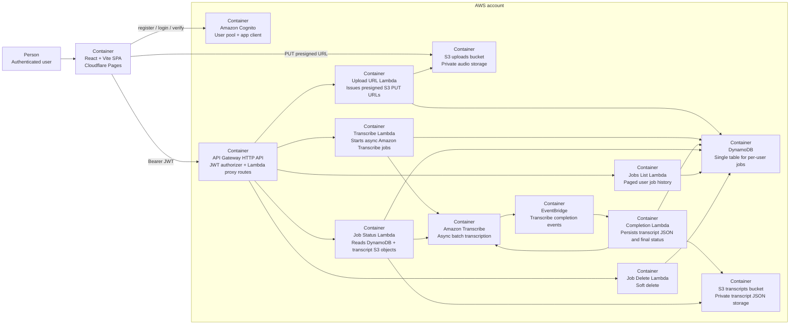

# Architecture

## Overview

Super Transcriber is a split deployment:

- a React single-page app hosted on Cloudflare Pages
- a serverless AWS backend made up of Cognito, API Gateway HTTP API, Lambda, DynamoDB, S3, Amazon Transcribe, and EventBridge

The design is intentionally biased toward low fixed cost and simple operations. The frontend handles auth, upload UX, polling, and transcript export. AWS handles identity, file storage, async transcription, job state, and transcript persistence.

## C4-Style Container Diagram

## Runtime Flow

1. The user registers or signs in against Cognito from the custom React forms.
2. The SPA stores the access, ID, and refresh tokens in Zustand memory and sends the access token to the HTTP API as a bearer token.
3. `POST /upload-url` checks the active-job cap in DynamoDB, generates a ULID-based job ID, and returns a presigned `PUT` URL for `uploads/{userId}/{jobId}/audio.{ext}`.
4. The browser uploads the MP3 or M4A file directly to S3 with XHR progress reporting.
5. `POST /transcribe` validates S3 key ownership, starts an async Amazon Transcribe job, and creates or updates the DynamoDB job record.
6. The transcript page polls `GET /job/{jobId}` with exponential backoff. While the job is pending, the API can ask Amazon Transcribe for the live status.
7. When Transcribe emits a completion event, EventBridge triggers the completion Lambda, which downloads the raw transcript JSON, stores it in the transcript bucket, and updates DynamoDB with final status and word count.
8. Once the job is completed, `GET /job/{jobId}` returns both the raw transcript JSON and the formatted speaker-labeled transcript text.

## Deployment Shape

- `terraform/` is the deployable infrastructure source of truth.
- `cdk/lambda/` contains the TypeScript Lambda handlers and shared helpers.
- `cdk/scripts/build-lambdas.mjs` bundles those handlers with esbuild into `terraform/dist/`.
- Terraform zips the bundled outputs from `terraform/dist/` into `.artifacts/` and deploys the Lambda functions.
- `frontend/` builds the static SPA with Vite.
- `.github/workflows/deploy-frontend.yml` deploys the frontend to Cloudflare Pages.
- `.github/workflows/deploy-aws.disabled.yml` is an optional AWS deploy workflow template that can be re-enabled after OIDC setup.

## Key Constraints

- Cost-first architecture: HTTP API, `arm64` Lambdas, DynamoDB `PAY_PER_REQUEST`, no VPC, no NAT Gateway, and S3 lifecycle cleanup.
- MP3 and M4A ingestion with client-side extension, file-header, file-size, and duration validation.
- Tokens are intentionally kept in memory only; no localStorage, sessionStorage, or cookies are used for Cognito session state.
- The product is tuned for personal-scale traffic: active jobs are capped at 5 per user and job listings are paged.
- Speaker diarization is currently configured for two speakers in the request path and UI.
- Amazon Transcribe availability is an external dependency of the target AWS account.
